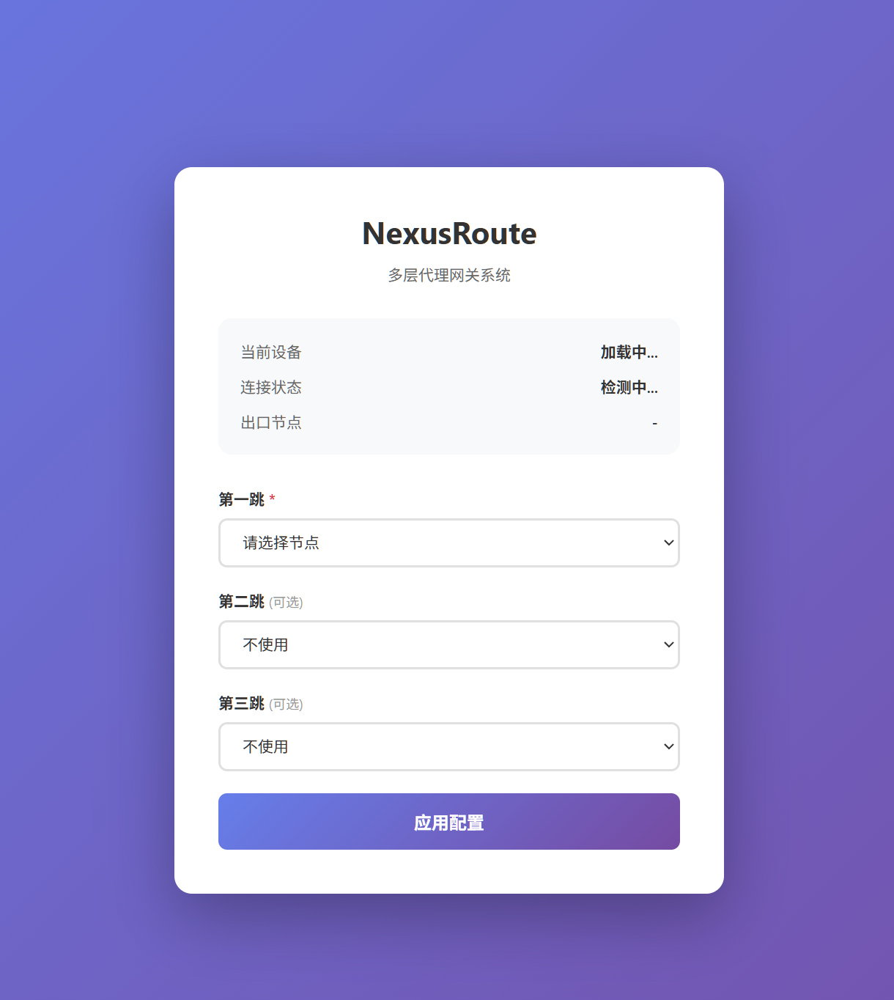

# NexusRoute - 多用户动态多层代理网关系统

<div align="center">



**让每个设备都能自由选择自己的代理路径**

[](LICENSE)
[](https://ubuntu.com)
[](https://nodejs.org)

[💡 这是什么](#-这是什么) • [🎬 工作原理](#-工作原理) • [🚀 快速开始](#-快速开始) • [📖 使用教程](#-使用教程) • [❓ 常见问题](#-常见问题)

</div>

---

## 💡 这是什么？

**NexusRoute** 是一个智能代理网关，让你的多台设备可以：

- 🎯 **各用各的代理**：爸爸用香港节点，妈妈用日本节点，孩子用美国节点，互不干扰
- 🔒 **绝不泄露IP**：代理断了就断网，不会暴露你的真实位置
- 🚀 **随时切换**：打开网页选一选，3秒换线路，不用重启路由器
- 👥 **自动管理**：新设备接入自动发现，管理员点一下批准就能用

### 一句话解释

> 把它想象成一个"智能代理管家"：每个设备都有自己的管家，你告诉管家"我要走香港-日本-美国这条路"，管家就帮你安排好，而且绝不会走错路或者走漏风声。

---

## 🎬 工作原理

### 简单版（给小白看的）

```
你的电脑/手机
    ↓
连接到 NexusRoute 网关
    ↓
打开网页 http://192.168.100.1/
    ↓
选择代理路径：香港 → 日本 → 美国
    ↓
点击"应用配置"
    ↓
开始上网，你的IP显示为美国
```

**关键点**：
- 每个设备可以选不同的路径
- 代理断了会自动断网（不会泄露真实IP）
- 切换路径只需要3秒

### 技术版（给懂行的看的）

```
┌─────────────────────────────────────────────────────────────┐
│                    NexusRoute 网关                           │
│                                                               │
│  ┌──────────┐  ┌──────────┐  ┌──────────┐                  │
│  │ Xray实例1│  │ Xray实例2│  │ Xray实例3│  (每个用户独立)  │
│  │ 用户A    │  │ 用户B    │  │ 用户C    │                  │
│  │ 香港→日本│  │ 美国     │  │ 新加坡→韩国│                │
│  └──────────┘  └──────────┘  └──────────┘                  │
│         ↑              ↑              ↑                      │
│         └──────────────┼──────────────┘                      │
│                        │                                      │
│              iptables TPROXY 透明代理                        │
│              (自动劫持流量，防止泄露)                         │
│                        │                                      │
└────────────────────────┼──────────────────────────────────────┘
                         │
        ┌────────────────┼────────────────┐
        │                │                │
    设备A            设备B            设备C
```

**核心技术**：
- **TPROXY 透明代理**：自动劫持所有流量，应用层无感知
- **多实例隔离**：每个用户独立的 Xray 进程，互不影响
- **Kill Switch**：FORWARD 链默认 DROP，代理断开 = 完全断网
- **MAC-IP 绑定**：防止 IP 欺骗攻击

### 新设备接入完整流程（全自动）

当你新增一台 Windows 设备时，系统会自动完成所有配置：

```
新 Windows 设备连接到 eth1
    ↓
dnsmasq 自动分配临时 IP (192.168.100.50-99)
    ↓
Node.js 后端每30秒扫描，自动发现新设备
    ↓
自动显示在管理后台"待审批设备"列表
    ↓
管理员点击"批准"按钮 ← 唯一需要人工操作的步骤
    ↓
后端自动执行以下操作：
  ✅ 基于 MAC 地址哈希生成固定 IP (192.168.100.10-209)
  ✅ 自动分配独立端口 (12345, 12346, 12347...)
  ✅ 自动分配 iptables mark (0x1, 0x2, 0x3...)
  ✅ 创建数据库用户记录 (user1, user2, user3...)
  ✅ 写入 dnsmasq 静态绑定配置
  ✅ 重启 dnsmasq 服务
  ✅ 创建独立的 systemd 服务文件
  ✅ 启动该用户的 Xray 服务
  ✅ 添加该用户的 iptables TPROXY 规则
    ↓
Windows 设备重新获取 IP (ipconfig /renew)
    ↓
获得永久 IP，可以访问 http://192.168.100.1/
    ↓
用户在网页上选择代理节点（1-3跳）
    ↓
后端自动生成 Xray 配置文件并重启服务
    ↓
开始上网，所有流量通过代理 ✅
```

**管理员只需要做什么？**
1. 添加代理节点（一次性配置）
2. 点击"批准"按钮（每个新设备一次）

**其他所有配置都是自动的！** 无需手动配置 IP、创建配置文件、编写防火墙规则。

---

## 🆚 与其他方案对比

| 特性 | 传统VPN | OpenWrt软路由 | NexusRoute |
|------|---------|--------------|------------|
| 多用户独立配置 | ❌ | ❌ | ✅ |
| 用户自主切换 | ❌ | ❌ | ✅ |
| 防IP泄露 | ⚠️ 可能泄露 | ⚠️ 配置复杂 | ✅ 强制保护 |
| 实时切换 | ❌ | ⚠️ 需重启 | ✅ 3秒切换 |
| 部署难度 | 简单 | 中等 | 简单 |
| 硬件要求 | 低 | 低 | 中 (2GB内存) |

**什么时候用 NexusRoute？**
- ✅ 家里有多台设备，每个人想用不同的代理
- ✅ 需要频繁切换代理线路（测试、工作需要）
- ✅ 对IP泄露零容忍（安全研究、隐私保护）
- ✅ 有虚拟机或NAS，想快速部署

**什么时候用 OpenWrt？**
- ✅ 所有设备用同一个代理就够了
- ✅ 需要极致性能（千兆带宽）
- ✅ 需要路由器的其他功能（广告过滤、QoS）

---

## 🚀 快速开始

### 前置条件

你需要一台运行 **Ubuntu Server 22.04** 的设备（虚拟机或物理机），并且有两个网卡：
- **网卡1 (eth0)**：连接外网
- **网卡2 (eth1)**：连接内网设备

### 三步安装

```bash
# 1. 下载项目
git clone https://github.com/Kxiandaoyan/NexusRoute.git
cd NexusRoute

# 2. 运行安装脚本
chmod +x install.sh
sudo ./install.sh

# 3. 按提示输入管理员密码，等待10分钟
```

安装完成后：
- 管理后台：http://192.168.100.1/admin
- 用户前台：http://192.168.100.1/

### 升级现有安装

如果你已经安装了 NexusRoute，可以使用一键升级脚本：

```bash
# 下载并执行升级脚本
curl -O https://raw.githubusercontent.com/Kxiandaoyan/NexusRoute/main/update.sh
chmod +x update.sh
sudo ./update.sh
```

升级脚本会自动：
- 从 GitHub 下载最新代码
- 备份现有配置和数据库
- 执行数据库迁移
- 重启服务
- 失败时自动回滚

详细升级说明请查看 [UPGRADE.md](UPGRADE.md)。

---

## 📖 使用教程

### 第一步：添加代理节点

1. 访问 http://192.168.100.1/admin
2. 登录（用户名：admin，密码：安装时设置的）
3. 点击"节点管理" → "添加节点"
4. 填写节点信息（支持 VMess/VLESS/Trojan/Shadowsocks/Socks5）
5. **选择跳数层级**（第一跳/第二跳/第三跳）

**示例**：
```
节点名称：香港01
跳数层级：第一跳
协议：VMess
服务器地址：hk.example.com
端口：443
UUID：xxxxxxxx-xxxx-xxxx-xxxx-xxxxxxxxxxxx
传输协议：WebSocket
TLS：启用
```

**重要**：节点层级绑定功能
- 添加节点时必须选择层级（第一跳/第二跳/第三跳）
- 每个节点只能在指定层级使用，防止混用暴露
- 用户配置路由时，每个跳数只显示对应层级的节点

### 第二步：连接设备

1. 将你的电脑/手机连接到网关的内网接口（eth1）
2. 设备会自动获取IP（192.168.100.50-99）
3. 在管理后台的"设备审批"中看到新设备
4. 点击"批准"，系统自动分配永久IP

### 第三步：选择代理路径

1. 在设备上访问 http://192.168.100.1/
2. 看到三个下拉框：
   - **第一跳**（必选）：只显示第一跳层级的节点
   - **第二跳**（可选）：只显示第二跳层级的节点
   - **第三跳**（可选）：只显示第三跳层级的节点
3. 点击"应用配置"
4. 等待3秒，开始上网

**出口IP说明**：
- 选1跳：出口是第1跳的IP
- 选2跳：出口是第2跳的IP
- 选3跳：出口是第3跳的IP

---

## 🎯 适用场景

### 1. 家庭多设备
```
爸爸的电脑 → 香港节点（看新闻）
妈妈的手机 → 日本节点（购物）
孩子的平板 → 美国节点（学习）
```

### 2. 工作测试
```
测试机1 → 香港节点（测试亚洲CDN）
测试机2 → 美国节点（测试美洲CDN）
测试机3 → 欧洲节点（测试欧洲CDN）
```

### 3. 安全研究
```
侦察阶段 → 单跳代理
扫描阶段 → 双跳代理
渗透阶段 → 三跳代理
```

### 4. 隐私保护
```
日常浏览 → 单跳代理
敏感操作 → 三跳代理 + Kill Switch
```

---

## 🛡️ 安全特性

### Kill Switch（断网防漏油）

**问题**：如果代理突然断了，会不会暴露真实IP？

**答案**：不会！NexusRoute 会立即切断网络。

**测试方法**：
```bash
# 在网关上停止代理
sudo systemctl stop xray-user1

# 在设备上测试
ping 8.8.8.8  # 应该超时（无法连接）
```

### MAC-IP 绑定

每个设备的 MAC 地址会绑定一个固定 IP，防止 IP 欺骗攻击。

### 无日志设计

系统不记录你访问了哪些网站，保护隐私。

---

## 🏗️ 部署场景

### 场景1：Hyper-V 虚拟机

```
Windows 物理机
  ├─ Ubuntu 虚拟机（网关）
  │   ├─ 网卡1：连接外网
  │   └─ 网卡2：连接内网
  └─ Windows 工作虚拟机（需要代理的设备）
```

### 场景2：家庭 NAS

```
群晖/威联通 NAS
  ├─ eth0：连接路由器（外网）
  └─ eth1：连接交换机（内网设备）
```

### 场景3：软路由

```
J1900/N5105 软路由
  ├─ eth0：连接光猫（外网）
  └─ eth1：连接交换机（内网设备）
```

详细配置步骤请查看 [部署指南](#详细部署指南)。

---

## ❓ 常见问题

### Q1: 需要什么硬件？
A: 一台运行 Ubuntu 22.04 的设备（虚拟机或物理机），至少 2GB 内存，两个网卡。

### Q2: 支持多少个设备？
A: 最多 200 个设备。

### Q3: 性能如何？
A: 单线程约 500Mbps，多线程约 800Mbps，适合家庭和小型团队。

### Q4: 可以用树莓派吗？
A: 可以，但需要树莓派 4B 以上，并且需要 USB 网卡作为第二个接口。

### Q5: 出口IP是哪个？
A: 最后一跳的节点IP。例如选择"香港→日本"，出口IP就是日本节点的IP。

### Q6: 如何备份配置？
A: 备份 `/opt/nexusroute/db.sqlite` 文件即可。

### Q7: 可以在 Docker 中运行吗？
A: 可以，但需要 `--privileged` 和 `--net=host` 权限。

### Q8: 与 OpenWrt 有什么区别？
A: OpenWrt 适合所有设备用同一个代理，NexusRoute 适合每个设备用不同的代理。

---

## 📚 详细部署指南

### Hyper-V 环境

<details>
<summary>点击展开详细步骤</summary>

#### 1. 创建虚拟交换机

**外部交换机（WAN）**：
- 名称：`Nexus_WAN`
- 类型：外部
- 绑定物理网卡

**内部交换机（LAN）**：
- 名称：`Nexus_LAN_Isolated`
- 类型：内部

#### 2. 配置 Ubuntu 虚拟机

- 网卡1：连接 `Nexus_WAN`
- 网卡2：连接 `Nexus_LAN_Isolated`

#### 3. 配置工作虚拟机

- 唯一网卡：连接 `Nexus_LAN_Isolated`

#### 4. 运行安装脚本

```bash
sudo ./install.sh
```

</details>

### NAS 环境

<details>
<summary>点击展开详细步骤</summary>

#### 1. 配置 NAS 网口

- eth0：连接路由器（DHCP 或静态IP）
- eth1：静态IP `192.168.100.1/24`

#### 2. 创建 Ubuntu 虚拟机

使用 Virtual Machine Manager 或 Docker。

#### 3. 运行安装脚本

```bash
sudo ./install.sh
```

</details>

### 软路由环境

<details>
<summary>点击展开详细步骤</summary>

#### 1. 安装 Ubuntu Server 22.04

下载 ISO 并安装到软路由。

#### 2. 识别网卡

```bash
ip link show
```

#### 3. 运行安装脚本

```bash
sudo ./install.sh
```

</details>

---

## 🛠️ 故障排查

### 设备无法获取IP

```bash
sudo systemctl status dnsmasq
sudo journalctl -u dnsmasq -n 50
```

### 设备无法上网

```bash
sudo iptables -t mangle -L -n -v
sudo systemctl status xray-user1
```

### 管理后台无法访问

```bash
sudo systemctl status nexusroute
sudo journalctl -u nexusroute -n 50
```

---

## 📄 许可证

本项目仅供以下合法用途：
- ✅ 合法授权的安全测试
- ✅ 隐私保护
- ✅ 学习研究
- ✅ 开发测试

⚠️ 禁止用于非法用途。

---

## 🤝 贡献

欢迎提交 Issue 和 Pull Request！

---

**项目地址**：https://github.com/Kxiandaoyan/NexusRoute  
**文档版本**：2.1  
**最后更新**：2026-04-10

## 📝 更新日志

### v2.1 (2026-04-10)
- ✨ 新增节点层级绑定功能，防止混用暴露
- 🔧 添加一键升级脚本，支持从 GitHub 自动更新
- 📚 完善升级文档和使用说明
- 🐛 修复 /admin 路由无法访问的问题

### v2.0 (2026-04-09)
- 🎉 首次发布
